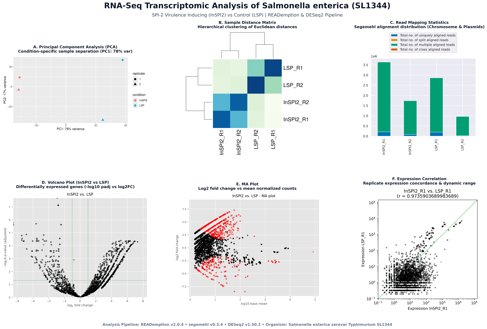

# RNA-Seq Analysis of *Salmonella enterica* using the READemption Pipeline

[](https://github.com/foerstner-lab/READemption)
[](https://www.bioinf.uni-leipzig.de/Software/segemehl/)
[](https://bioconductor.org/packages/release/bioc/html/DESeq2.html)
[](https://www.python.org/)

<p align="center">
  
</p>
<p align="center">
  <em><b>Figure 1: Comprehensive RNA-seq transcriptomic profiling and differential gene expression analysis in Salmonella enterica SL1344 (InSPI2 vs. LSP).</b></em>
</p>

An end-to-end, fully reproducible RNA-seq analysis pipeline for **_Salmonella enterica_ subsp. _enterica_ serovar Typhimurium str. SL1344** comparing bacterial transcriptomes under SPI-2 virulence-inducing conditions (**InSPI2**) versus control/neutral conditions (**LSP**) using the **READemption** computational framework.

---

## 📑 Table of Contents
- [1. Biological Context & Objectives](#1-biological-context--objectives)
- [2. Experimental Design & Dataset](#2-experimental-design--dataset)
- [3. Workflow Architecture](#3-workflow-architecture)
- [4. Installation & Environment Setup](#4-installation--environment-setup)
- [5. Pipeline Execution](#5-pipeline-execution)
- [6. Summary of Results](#6-summary-of-results)
  - [Read Alignment Statistics](#read-alignment-statistics)
  - [Gene Quantification & Normalization](#gene-quantification--normalization)
  - [Differential Gene Expression (DESeq2)](#differential-gene-expression-deseq2)
  - [Quality Control & Visualization Plots](#quality-control--visualization-plots)
- [7. Technical Fixes & Troubleshooting](#7-technical-fixes--troubleshooting)
- [8. Repository Structure](#8-repository-structure)
- [9. Citation & References](#9-citation--references)

---

## 1. Biological Context & Objectives

*Salmonella enterica* serovar Typhimurium is a facultative intracellular pathogen responsible for enteritis and systemic infections. Pathogenesis is tightly controlled by Salmonella Pathogenicity Islands (SPIs):
- **SPI-2 (Salmonella Pathogenicity Island 2)**: Encodes a Type III Secretion System (T3SS-2) crucial for intracellular survival and replication inside host macrophages.
- **InSPI2 Condition**: An *in vitro* growth condition mimicking the acidic, phosphate-limiting environment of the *Salmonella*-containing vacuole (SCV) to trigger SPI-2 expression.
- **LSP Condition**: Control / neutral growth condition.

**Objective**: Determine global transcriptional rewiring and identify significantly up- and down-regulated genes and non-coding features between `InSPI2` and `LSP` states.

---

## 2. Experimental Design & Dataset

### Samples & Replicates
| Sample ID | Condition | Biological Replicate | Library Type | File Name |
| :--- | :--- | :---: | :---: | :--- |
| `InSPI2_R1` | SPI-2 Inducing | 1 | Single-End FASTA | `InSPI2_R1.fa.bz2` |
| `InSPI2_R2` | SPI-2 Inducing | 2 | Single-End FASTA | `InSPI2_R2.fa.bz2` |
| `LSP_R1` | Neutral / Control | 1 | Single-End FASTA | `LSP_R1.fa.bz2` |
| `LSP_R2` | Neutral / Control | 2 | Single-End FASTA | `LSP_R2.fa.bz2` |

### Genomic Reference Sequences
- **Main Chromosome**: *Salmonella enterica* SL1344 [`NC_016810.1`](https://www.ncbi.nlm.nih.gov/nuccore/NC_016810.1) (4,878,012 bp)
- **Plasmid pCol1B9**: [`NC_017718.1`](https://www.ncbi.nlm.nih.gov/nuccore/NC_017718.1) (86,908 bp)
- **Plasmid pRSF1010**: [`NC_017719.1`](https://www.ncbi.nlm.nih.gov/nuccore/NC_017719.1) (8,688 bp)
- **Plasmid pSLT (Virulence)**: [`NC_017720.1`](https://www.ncbi.nlm.nih.gov/nuccore/NC_017720.1) (93,842 bp)
- **Genome Annotation**: NCBI RefSeq / GFF3 [`GCF_000210855.2_ASM21085v2_genomic.gff`](https://www.ncbi.nlm.nih.gov/assembly/GCF_000210855.2)

---

## 3. Workflow Architecture

```
                    ┌────────────────────────────────────────┐
                    │      Input Single-End Reads (.bz2)     │
                    │      (InSPI2_R1/R2, LSP_R1/R2)         │
                    └───────────────────┬────────────────────┘
                                        │
                                        ▼
                    ┌────────────────────────────────────────┐
                    │       1. reademption align             │
                    │   • segemehl indexing & read mapping   │
                    │   • Coordinate-sorted & indexed BAM    │
                    └───────────────────┬────────────────────┘
                                        │
                                        ▼
                    ┌────────────────────────────────────────┐
                    │       2. reademption coverage          │
                    │   • Strand-specific nucleotide coverage│
                    │   • Raw & TNOAR-normalized .wig tracks │
                    └───────────────────┬────────────────────┘
                                        │
                                        ▼
                    ┌────────────────────────────────────────┐
                    │       3. reademption gene_quanti       │
                    │   • Feature-level quantification (GFF) │
                    │   • Raw Counts, RPKM, TNOAR, TPM       │
                    └───────────────────┬────────────────────┘
                                        │
                                        ▼
                    ┌────────────────────────────────────────┐
                    │       4. reademption deseq             │
                    │   • Negative Binomial GLM via DESeq2   │
                    │   • Size factors, dispersion & log2FC  │
                    │   • Sample distance heatmap & PCA      │
                    └───────────────────┬────────────────────┘
                                        │
                                        ▼
                    ┌────────────────────────────────────────┐
                    │   5, 6, 7. reademption viz_*           │
                    │   • Alignment length & species stats   │
                    │   • Expression correlation scatters    │
                    │   • Volcano plots & MA plots           │
                    └────────────────────────────────────────┘
```

---

## 4. Installation & Environment Setup

The analysis environment is managed via Miniforge/Conda with Python 3.9 and R 4.5.

### Automated Setup
```bash
git clone https://github.com/Abdul3442/RNA-Seq-analysis-of-salmonella-using-READemption-pipeline.git
cd RNA-Seq-analysis-of-salmonella-using-READemption-pipeline
bash Installation.sh
```

### Manual Conda Environment Creation
```bash
# Create dedicated environment
conda create -n reademption -c conda-forge -c bioconda python=3.9 segemehl=0.3.4 samtools r-base r-ggplot2 r-rcolorbrewer bioconductor-deseq2 -y

# Activate and install READemption
conda activate reademption
pip install READemption==2.0.4
```

---

## 5. Pipeline Execution

To run the complete automated analysis from beginning to end:
```bash
bash Analysis.sh
```

Or execute individual stages:

```bash
# Step 1: Read Alignment
reademption align -F -p 4 --project_path READemption_analysis --progress

# Step 2: Strand-Specific Coverage Calculation
reademption coverage -F -p 4 --project_path READemption_analysis

# Step 3: Gene Quantification
reademption gene_quanti -F -p 4 --project_path READemption_analysis

# Step 4: Differential Expression Analysis (DESeq2)
reademption deseq --project_path READemption_analysis \
  --libs "InSPI2_R1.fa.bz2,InSPI2_R2.fa.bz2,LSP_R1.fa.bz2,LSP_R2.fa.bz2" \
  --conditions "InSPI2,InSPI2,LSP,LSP" \
  --replicates "1,2,1,2" \
  --libs_by_species salmonella="InSPI2_R1.fa.bz2,InSPI2_R2.fa.bz2,LSP_R1.fa.bz2,LSP_R2.fa.bz2"

# Step 5: Visualizations
reademption viz_align --project_path READemption_analysis
reademption viz_gene_quanti --project_path READemption_analysis
reademption viz_deseq --project_path READemption_analysis
```

---

## 6. Summary of Results

### Read Alignment Statistics
Summary of read mapping across chromosomes and plasmids:

| Sample | Input Reads | Aligned Reads | Uniquely Aligned | Multi Aligned | Total Alignments | Chromosome Mapped (`NC_016810.1`) |
| :--- | :---: | :---: | :---: | :---: | :---: | :---: |
| **InSPI2_R1** | 1,000,000 | 3,639,076 | 212,210 | 3,426,866 | 23,310,394 | 3,638,865 |
| **InSPI2_R2** | 1,000,000 | 1,740,469 | 86,176 | 1,654,293 | 10,854,141 | 1,740,394 |
| **LSP_R1** | 1,000,000 | 2,862,463 | 199,137 | 2,663,326 | 17,610,049 | 2,862,085 |
| **LSP_R2** | 1,000,000 | 969,341 | 27,080 | 942,261 | 5,897,411 | 969,302 |

Detailed tables: [`output/align/reports_and_stats/read_alignment_stats_transposed.csv`](READemption_analysis/output/align/reports_and_stats/read_alignment_stats_transposed.csv).

### Gene Quantification & Normalization
Expression values for all 10,000+ genomic features were quantified and normalized:
- **Raw Counts**: [`output/salmonella_gene_quanti_combined/gene_wise_quantifications_combined.csv`](READemption_analysis/output/salmonella_gene_quanti_combined/gene_wise_quantifications_combined.csv)
- **RPKM Normalized**: [`output/salmonella_gene_quanti_combined/gene_wise_quantifications_combined_rpkm.csv`](READemption_analysis/output/salmonella_gene_quanti_combined/gene_wise_quantifications_combined_rpkm.csv)
- **TPM Normalized**: [`output/salmonella_gene_quanti_combined/gene_wise_quantifications_combined_tpm.csv`](READemption_analysis/output/salmonella_gene_quanti_combined/gene_wise_quantifications_combined_tpm.csv)
- **TNOAR Normalized**: [`output/salmonella_gene_quanti_combined/gene_wise_quantifications_combined_tnoar.csv`](READemption_analysis/output/salmonella_gene_quanti_combined/gene_wise_quantifications_combined_tnoar.csv)

### Differential Gene Expression (DESeq2)
Pairwise comparison between **InSPI2** (SPI-2 inducing) and **LSP** (control):
- **Full Annotated Results**: [`output/salmonella_deseq/deseq_with_annotations/deseq_comp_InSPI2_vs_LSP_with_annotation_and_countings.csv`](READemption_analysis/output/salmonella_deseq/deseq_with_annotations/deseq_comp_InSPI2_vs_LSP_with_annotation_and_countings.csv)
- **Reverse Comparison**: [`output/salmonella_deseq/deseq_with_annotations/deseq_comp_LSP_vs_InSPI2_with_annotation_and_countings.csv`](READemption_analysis/output/salmonella_deseq/deseq_with_annotations/deseq_comp_LSP_vs_InSPI2_with_annotation_and_countings.csv)

### Quality Control & Visualization Plots
All publication-ready PDF figures are generated in their respective output directories:
- **PCA & Sample Heatmap**: `output/salmonella_deseq/deseq_raw/sample_comparison_pca_heatmap.pdf`
- **Volcano Plots**: `output/salmonella_viz_deseq/volcano_plots_log2_fold_change_vs_adjusted_p-value.pdf`
- **MA Plots**: `output/salmonella_viz_deseq/MA_plots.pdf`
- **Expression Scatter Plots**: `output/salmonella_viz_gene_quanti/expression_scatter_plots.pdf`
- **Read Length QC**: `output/read_lengths_viz_align/input_reads_length_distributions.pdf`

---

## 7. Technical Fixes & Troubleshooting

During development and execution, several upstream compatibility issues were diagnosed and resolved:
1. **READemption Segemehl Flag Patch**: Removed unsupported `--bamabafixoida` flag in `reademptionlib/segemehl.py` (lines 59–71).
2. **NCBI Reference FASTA Curation**: Replaced a corrupted 16MB multi-concatenated chromosome FASTA with the clean, authentic `NC_016810.1` FASTA (4,878,012 bp), preventing duplicate `@SQ` BAM headers.
3. **DESeq Distance Heatmap Patch**: Replaced legacy `gplots::heatmap.2` dependency in `reademptionlib/deseq.py` with base R `heatmap()` coupled with `RColorBrewer` color palettes.

---

## 8. Repository Structure
 
```
├── .gitignore
├── README.md                # Project documentation
├── Installation.sh          # Environment & dependency setup
├── Analysis.sh              # 7-step automated analysis script
├── generate_figures.py      # Publication figure composite script
├── figures/
│   ├── Figure1_Transcriptomic_Overview.png  # Multi-panel publication figure
│   └── Figure1_Transcriptomic_Overview.pdf  # Vector PDF format
└── READemption_analysis/
    ├── config.json          # READemption species config
    ├── input/
    │   ├── reads/                               # Raw FASTA reads (.fa.bz2)
    │   ├── salmonella_reference_sequences/     # NC_016810, NC_017718, NC_017719, NC_017720
    │   └── salmonella_annotations/             # GFF3 gene annotations
    └── output/
        ├── align/reports_and_stats/             # Mapping statistics & JSON metrics
        ├── all_species_viz_align/               # Stacked species distribution plots
        ├── read_lengths_viz_align/              # Read length QC plots
        ├── salmonella_deseq/                    # DESeq2 tables & PCA/Heatmap PDFs
        │   ├── deseq_raw/
        │   └── deseq_with_annotations/
        ├── salmonella_gene_quanti_combined/     # Raw, RPKM, TPM, TNOAR tables
        ├── salmonella_gene_quanti_per_lib/      # Sample-wise quantification tables
        ├── salmonella_viz_align/                # Aligned reads summary plots
        ├── salmonella_viz_deseq/                # Volcano and MA plots
        └── salmonella_viz_gene_quanti/          # Expression scatter & class size plots
```

---

## 9. Citation & References

- **READemption**: Förstner KU, Vogel J, Sharma CM. (2014). *READemption—a tool for the computational analysis of deep-sequencing-based transcriptome data*. Bioinformatics, 30(23), 3421-3423.
- **segemehl**: Hoffmann S, Otto C, Kurtz S, Sharma CM, Khaitovich P, Vogel J, Stadler PF. (2009). *Fast mapping of short sequences with multiple mismatches, insertions and deletions using suffix arrays*. PLoS Comput Biol, 5(9), e1000502.
- **DESeq2**: Love MI, Huber W, Anders S. (2014). *Moderated estimation of fold change and dispersion for RNA-seq data with DESeq2*. Genome Biology, 15(12), 550.
